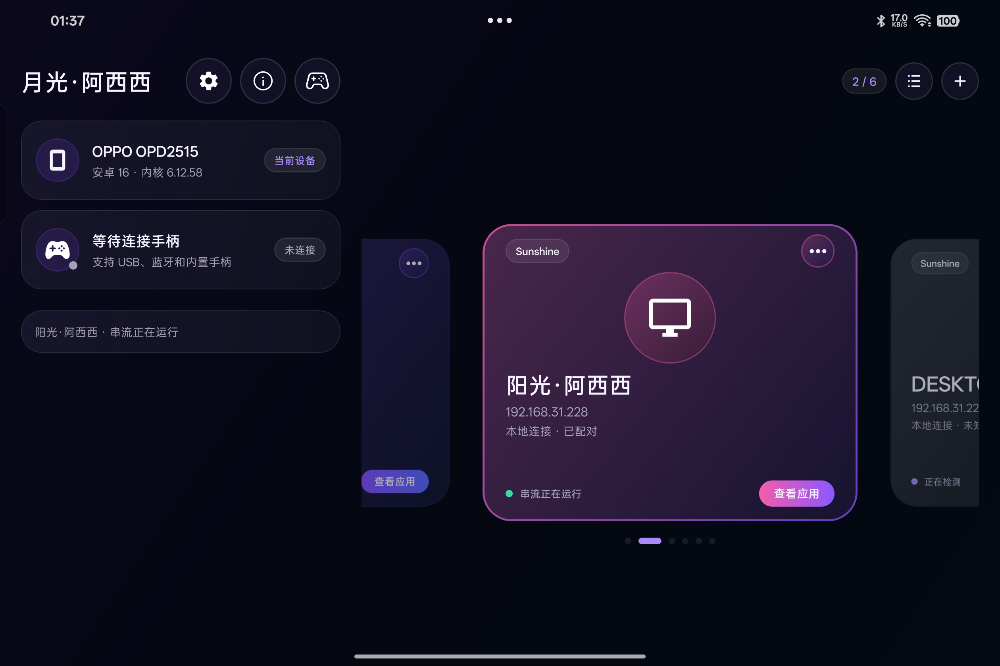
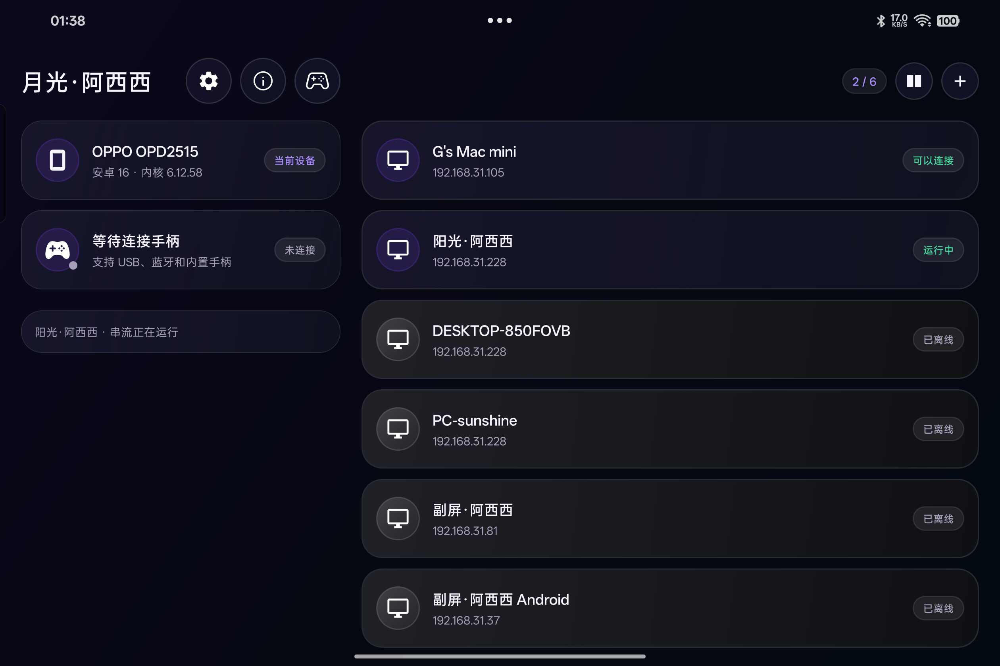
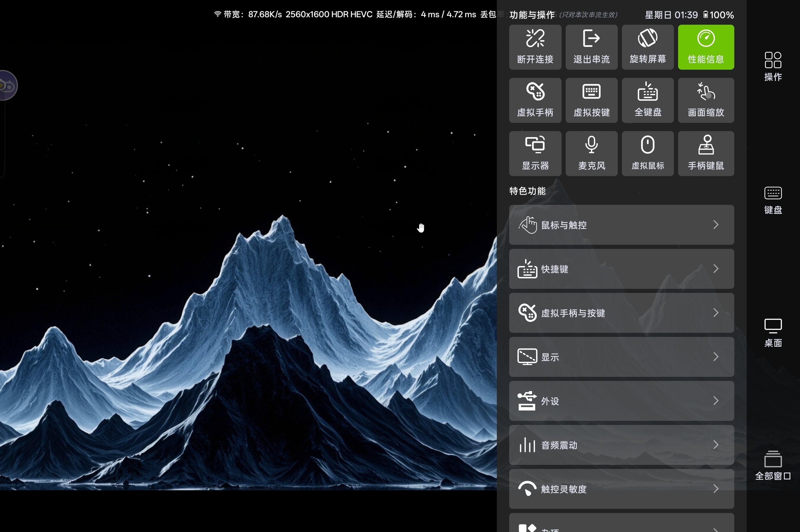
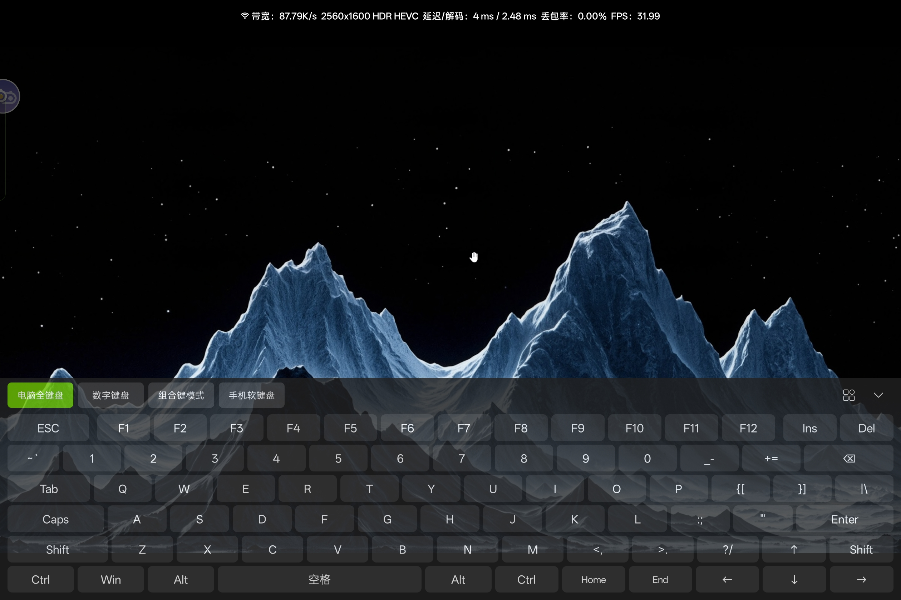
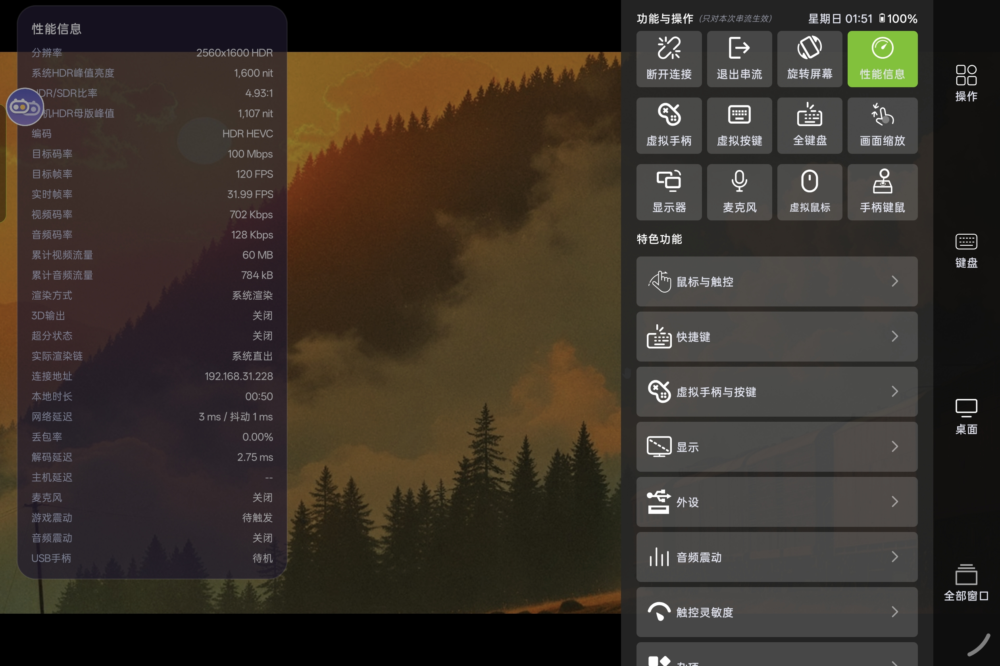

# 月光·阿西西

基于 [Moonlight Android](https://github.com/moonlight-stream/moonlight-android) 持续开发的安卓游戏串流客户端，将电脑上的游戏和桌面串流到手机、平板等 Android 设备。在 Moonlight 的基础上，重新设计界面，并扩展触控操作、手柄支持、画面显示与性能信息。

## 下载与相关版本

| 项目 | 下载入口 |
| --- | --- |
| 月光·阿西西 Android 版 | [GitHub Releases](https://github.com/Axixi2233/moonlight-android/releases) · [项目网盘（夸克）](https://pan.quark.cn/s/9a334d831290) |
| Sunshine·阿西西（电脑串流服务端） | [GitHub Releases](https://github.com/Axixi2233/Sunshine/releases) |
| StarCore 星核（macOS串流服务端） | [项目网盘（夸克）](https://pan.quark.cn/s/9a334d831290) |
| iOS 版 · StarLight | [App Store](https://apps.apple.com/us/app/starlight-pc-streaming/id6761065654) |
| tvOS 版 · StarLight | [App Store](https://apps.apple.com/us/app/星光-阿西西-tv版/id6792559600) |
| 鸿蒙版 · 月光·阿西西 | [华为应用市场](https://appgallery.huawei.com/app/detail?id=cn.axi.moonlight.hw) |

在电脑上安装并配置 Sunshine·阿西西、StarCore 星核（macOS）或其他兼容服务端，在客户端添加电脑、完成配对，即可选择游戏或桌面开始串流。

以下功能介绍对应本仓库的 Android 版，其他平台以各自版本为准。

## 主要功能

### 串流与界面

- 全新首页与游戏菜单，支持主机卡片、列表切换，集中查看设备、手柄和连接状态。
- 自定义分辨率、帧率与码率，按设备和网络环境调整串流参数。
- 息屏、切换后台后恢复串流；后台连接中断时，返回应用可自动尝试回连。
- 支持横竖屏切换、画面缩放与顶部对齐，适应手机、平板和折叠屏的操作习惯。

### 画面与外接显示

- 支持系统直出与 GLES 渲染，可在 GLES 模式下启用 FSR 超分辨率并调整锐度。
- 支持 HDR 输出，以及 GLES 下的原生 HDR 与 SDR 色调映射选项。
- 支持外接显示器，画面输出到外屏，手机保留输入和菜单操作。
- 支持 SBS 2D 转 3D、Full-SBS / Half-SBS 显示及立体效果调节，可搭配兼容的 AR 眼镜使用。

HDR、外接显示和手柄高级反馈的可用性取决于设备、系统与服务端支持；SBS 模式使用 SDR 输出。

### 触控、鼠标与键盘

- 自定义虚拟手柄与按键布局，支持配置导入、导出，自由摇杆及设备陀螺仪输入。
- 多种鼠标与触控模式：普通鼠标、多点触控、触控板、本地鼠标及禁用触屏操作。
- 多手势触控板支持左右键、双指滚动、缩放和边缘移动，可调整触控区域与灵敏度。
- 提供虚拟鼠标、手柄键鼠模式、自定义快捷指令，以及可移动、空闲自动隐藏的 DS 触控板。
- 内置全键盘、数字键盘和组合键模式，支持切换手机软键盘及竖屏快捷键栏。

### 手柄、震动与音频

- 支持 USB、蓝牙及内置手柄，扩展适配 DualShock 4、DualSense、Switch Pro 等 USB 手柄驱动。
- 支持兼容设备的震动、陀螺仪与 DualSense 自适应扳机等反馈。
- 音频震动可调整输出目标、强度与人声过滤，也可选择使用设备自身的震动马达。
- 集成全新改版的阿西西手柄测试组件，支持按键、摇杆、震动、陀螺仪及音频震动等测试。
- 支持麦克风上行，可在游戏菜单中快捷开关。

### 性能信息与诊断

- 提供精简与完整两种性能信息，查看实时帧率、码率、网络延迟、解码耗时与丢包情况。
- 完整性能信息展示渲染方式、超分状态、麦克风、音频震动及 USB 手柄状态。
- HDR 串流时可查看系统 HDR 峰值亮度、HDR/SDR 比例和主机 HDR 母版峰值，具体项目以系统和主机提供的信息为准。
- 支持串流日志采集，便于反馈连接、解码和外设问题。

## 界面预览

| 首页 · 主机卡片 | 首页 · 主机列表 |
| --- | --- |
|  |  |

| 串流游戏菜单 | 虚拟全键盘 |
| --- | --- |
|  |  |

### 完整性能信息

查看 HDR 亮度、HDR/SDR 比例、实时帧率、码率、延迟与外设状态。



## 构建

使用 Android Studio 打开项目，通过 SDK Manager 安装 Android SDK 34 和 NDK `27.0.12077973`。Gradle 使用项目自带 Wrapper，并配置兼容的 JDK（本地验证使用 JDK 21）。

初始化子模块：

```shell
git submodule update --init --recursive
```

由 Android Studio 配置 SDK 路径，或在本地 `local.properties` 中设置 `sdk.dir`。构建不包含可选私有模块的非 Root 调试版：

```shell
./gradlew -PincludeKishiHaptics=false -PincludeStereo3dAi=false :app:assembleNonRootDebug
```

Windows PowerShell 使用 `./gradlew.bat` 执行相同参数。APK 输出到 `app/build/outputs/apk/nonRoot/debug/`。可选私有模块未包含时，对应的专用触觉反馈或 AI 3D 能力不随构建提供。

## 交流与贡献

欢迎通过 [Issues](https://github.com/Axixi2233/moonlight-android/issues) 反馈问题，或提交 PR 分享功能与改进。反馈串流问题时，请附上设备型号、系统版本、服务端版本、串流设置及相关日志。

喜欢数码和游戏，也欢迎关注：[B 站](https://space.bilibili.com/16893379) · [YouTube](https://www.youtube.com/@AxixiTV)。

## 致谢与许可证

感谢 [Moonlight Android](https://github.com/moonlight-stream/moonlight-android)、[Sunshine](https://github.com/LizardByte/Sunshine) 及相关开源项目，感谢所有参与贡献与测试的朋友。

Moonlight 原作者包括 [Cameron Gutman](https://github.com/cgutman)、[Diego Waxemberg](https://github.com/dwaxemberg)、[Aaron Neyer](https://github.com/Aaronneyer) 和 [Andrew Hennessy](https://github.com/yetanothername)。

本仓库许可证见 [GPL-3.0](LICENSE.txt)。
